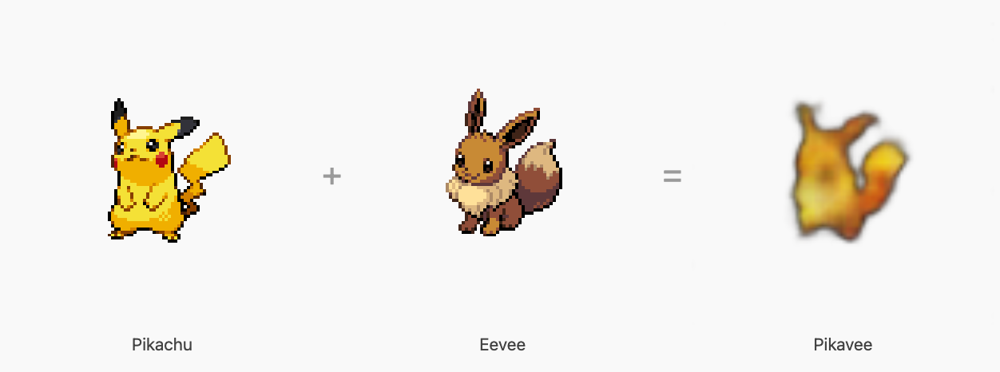
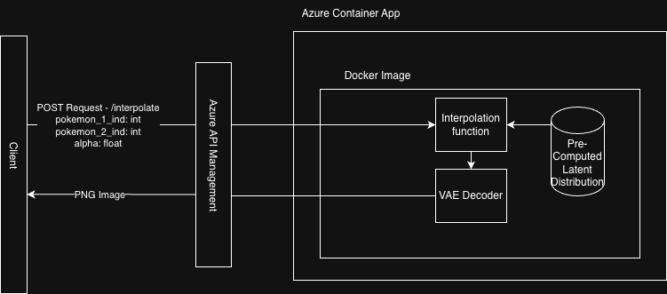

# PokAE Interpolator

[Live App](https://brave-water-0f1e3a510.7.azurestaticapps.net/) · [GitHub](https://github.com/brybranmuffin/gen_ai_image_project)

## Overview

PokAE Interpolator is an application that allows users to explore what it would look like if they combined their two favorite Pokémon together. It uses a Variational Autoencoder (VAE) to encode latent representations of nearly all 1,025 different species of currently discovered Pokémon. PokAE Interpolator uses spherical linear interpolation (SLERP) to smoothly combine the encoded features of each Pokémon, generating hours of exploration and fun for the user.



## Extra Criteria - Gallery UI

- **Novel interpolation UI** — A custom slider-based interface lets users select two Pokémon and control the interpolation weight between them in real time, generating a fused image on demand.
- **Azure hosting** — The application is fully deployed on Azure, with the inference backend running as a containerized FastAPI service behind Azure API Management, and the frontend hosted on Azure Static Web Apps.
- **Fusion gallery** — The application includes a curated gallery of generated fusion examples to give users an idea of what interpolated images look like before they start exploring on their own.

## Difficulties

### Image Data Issues

The current application was trained on all Pokémon except **#698 - Tyrunt**. The source image was corrupted and could not be recovered, so Tyrunt was excluded from the dataset.

### Loss Plateau

Training loss plateaued around epoch 300 and showed no meaningful improvement through at least epoch 500. On re-examining the training pipeline, it became clear that augmenting images offline (pre-generating copies before training) rather than sampling augmentations dynamically at training time was likely a contributing factor. The pipeline was updated to sample augmented views from raw sprites at training time, but the loss did not improve further, suggesting the model had reached its capacity ceiling for this dataset size.

### Interpolated Image Quality

Linear interpolation was the initial approach for combining latent vectors, but the quality and feature blending between distant Pokémon were lacking. Switching to spherical linear interpolation (SLERP) improved image sharpness slightly in some cases by interpolating along the surface of the latent space rather than cutting straight through it.

### Azure and Docker Deployment

Several issues came up when learning to deploy the Docker image to Azure and connecting Azure Container Apps to API Management. All in all, not a difficult project for this level of application.



## How to run

The live app is hosted on Azure. You can find it here: https://brave-water-0f1e3a510.7.azurestaticapps.net/

The frontend is configured to call the hosted Azure API, so there is no way to run the full end-to-end application locally without repointing the frontend. However, the backend and frontend can each be run independently.

### Running training locally

1. Download sprites

```bash
cd pokemon_sprites
python download_pokemon_sprites.py
```

2. Install dependencies and train

```bash
cd model_scripts
pip install -r requirements.txt
python train.py --sprites_dir ../pokemon_sprites --checkpoint_dir ../checkpoints --log_dir ../logs
```

### Building and testing the backend locally

Make sure Docker Desktop is running before proceeding.

1. Build the image

```bash
cd ./docker_backend
docker build -t pokae_backend .
```


2. Start the container

```bash
docker run -p 8000:8000 pokae_backend
```

The API will be available at `http://localhost:8000`. The interactive docs are at `http://localhost:8000/docs`.

3. Test an interpolation request

```bash
curl -s -X POST \
  "http://localhost:8000/interpolate?pokedex_id_1=25&pokedex_id_2=133&alpha=0.5" \
  --output fusion.png
```

This blends Pikachu (25) and Eevee (133) at equal weight and writes the result to `fusion.png`. Swap the Pokédex IDs and `alpha` value (0.0–1.0) to generate other fusions.


### Running the frontend locally

```bash
cd ./frontend
npm install
npm run dev
```


